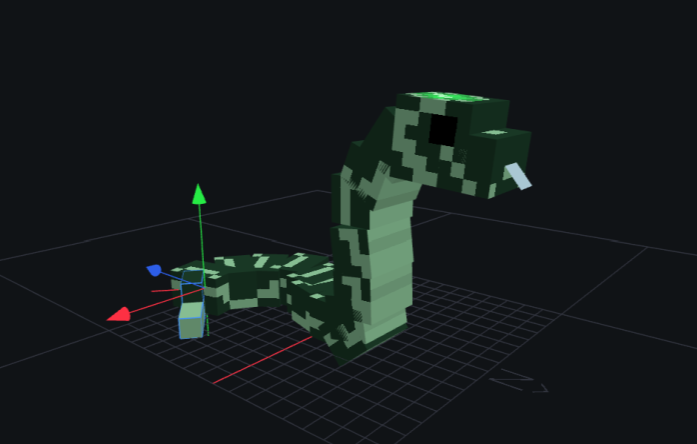

# CURIOUS CRYSTALS MINECRAFT MOD – README

## Korte beschrijving
De **Curious Crystals Mod** voor Minecraft 1.20.1 voegt nieuwe gems, mobs en structures en een Gem Enchanter werking toe waarmee items geüpgradet kunnen worden.  

**Screenshots:**  

---

## Installatie

1. Installeer **Minecraft 1.20.1**  
2. Installeer **<a href="https://fabricmc.net/" target="_blank">Fabric Loader</a>**  
3. Plaats het `.jar`-bestand in `/.minecraft/mods/`  
4. Start Minecraft  

**Smithing table gebruik:**  
- Plaats een basis item (bijv. Diamond Sword)  
- Voeg een gem toe  
- Haal het geüpgradede item eruit  

---

## Uitleg voor beoordeling
De mod word getest door vrienden, familie en medestudenten. Feedback:

---

## Beoordelingsdomeinen
1. **Programmeren**
2. **Interactie / User Experience**
3. **Gamedesign / Creativiteit**
